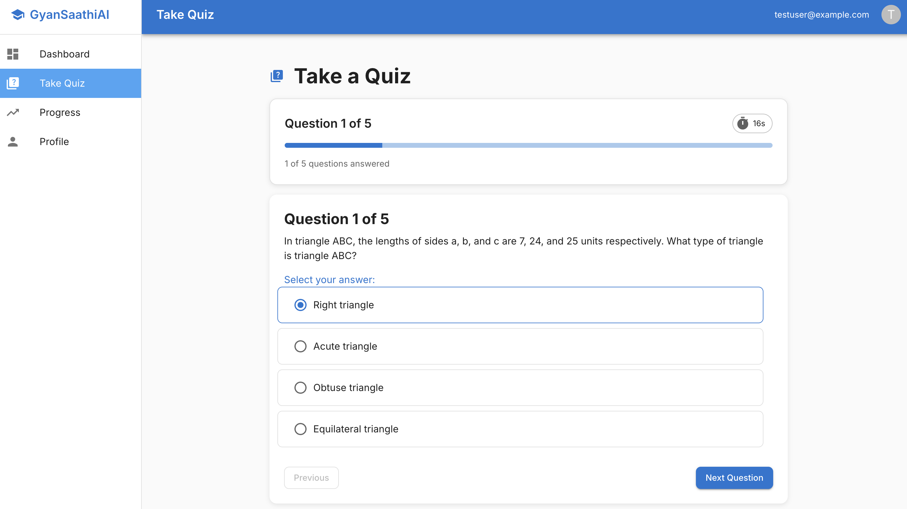
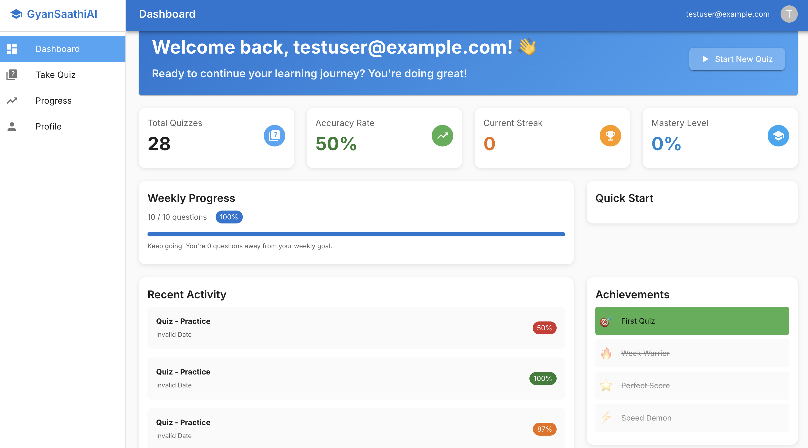

# GyanSaathiAI

An AI-powered tutoring platform with subject/topic-specific quizzes, LLM-driven question generation, and Airflow-based batch pipelines. Built with React, Node.js (GraphQL), FastAPI (LangChain/LangGraph), PostgreSQL, MongoDB, Redis, and Airflow — orchestrated via Docker Compose.

## Highlights
- Subject and topic filters with clean quiz UX
- Agent service for on-demand and batch question generation
- RAG (pgvector) grounding, validation, and persistence in MongoDB
- GraphQL backend for progress, analytics, and quiz attempts
- Docker-first local setup; Airflow for scalable batch jobs

## Architecture
```
Frontend (React)  ⇄  Backend (Node/GraphQL)  ⇄  Postgres (quizzes/progress)
         │                    │
         ▼                    └── MongoDB (questions)
Nginx (80)
Agent (FastAPI/LangChain) ⇄ pgvector (embeddings) ⇄ Airflow (batch)
```

## Screenshots

```


```

## Quick Start
1) Prerequisites: Docker Desktop, ports 80/5000/8000/8080 free
2) Create .env at repo root:
```
OPENAI_API_KEY=sk-...
```
3) Launch services:
```
docker compose up -d
curl http://localhost:5000/api/v1/health
curl http://localhost:8000/health
curl -u airflow:airflow http://localhost:8080/api/v1/health
```
4) URLs
- Frontend: http://localhost
- Backend: http://localhost:5000 (REST) / http://localhost:5000/graphql
- Agent: http://localhost:8000
- Airflow UI: http://localhost:8080 (airflow / airflow)

## Using the App
- Quiz: choose Subject, Topic, and question count → Start
- Selection logic: case-insensitive subject/topic; prefers active, tops up from draft during development; if topic has no matches, returns a clear error

## Agent & Batch Generation
Single question:
```bash
curl -X POST http://localhost:8000/admin/generate/question/v2 \
  -H 'Content-Type: application/json' \
  -d '{
    "subject":"Mathematics",
    "topic":"Geometry",
    "difficulty":"medium",
    "question_type":"multiple_choice"
  }'
```
Batch via Airflow (triggered through Agent):
```bash
curl -X POST http://localhost:8000/admin/airflow/submit-batch \
  -H 'Content-Type: application/json' \
  -d '{
    "subject":"Mathematics",
    "topic":"Geometry",
    "total_questions":25,
    "difficulty":"medium",
    "concurrency":5
  }'
# Latest run
curl -u airflow:airflow \
  'http://localhost:8080/api/v1/dags/generate_questions_batch/dagRuns?order_by=-start_date&limit=1'
```

## Admin Ops

Ingest corpus for RAG:
```bash
curl -X POST http://localhost:8000/ingestSampleCorpus
curl -X POST http://localhost:8000/ingestEmbedding \
  -H 'Content-Type: application/json' \
  -d '{"content":"...","metadata":{"subject":"math","chapter":"Algebra"}}'
```


## License
Demo project; dependencies retain their respective licenses.
